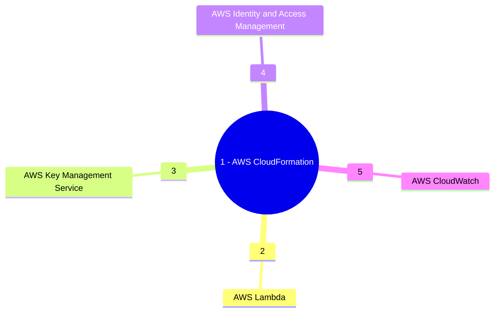

&nbsp;&nbsp;&nbsp;&nbsp;&nbsp;&nbsp;&nbsp;&nbsp;&nbsp;


# Project Taurus: Demo Lambda function with a Layer attached.

This is a repo to demonstrate the capability of Lambda Layer. This demo projects created two Lambda Layers and attaches them to a Lambda function. The stack is created using CI/CD pipeline. The name of the directory containing the library python code should start with **lambda-layer-** and there must be a directory named **python** which will contain the Python library codes. The direcory structure for this project will be as follows:

```
Repository Root
├─ cft
├─ nested-stacks
├─-- lambda-layer-stack.yaml
├─- root-stack-template.yaml
├─ root-stack-template
├─ lambda-layer-<lib name>
├─-- python
├─--- library-file.py
├─ lambda-layer-<lib name 2>
├─-- python
├─--- library-file-2.py
├─ lambda-layer-<lib name>
├─-- parameters
├─--- cfn-parameters.json

```

## Description 
*(source AWS https://docs.aws.amazon.com/lambda/latest/dg/chapter-layers.html)*

A Lambda layer is a .zip file archive that contains supplementary code or data. Layers usually contain library dependencies, a custom runtime, or configuration files.

There are multiple reasons why you might consider using layers:

1. **To reduce the size of your deployment packages.** Instead of including all of your function dependencies along with your function code in your deployment package, put them in a layer. This keeps deployment packages small and organized.

1. **To separate core function logic from dependencies.** With layers, you can update your function dependencies independent of your function code, and vice versa. This promotes separation of concerns and helps you focus on your function logic.
1. **To share dependencies across multiple functions.** After you create a layer, you can apply it to any number of functions in your account. Without layers, you need to include the same dependencies in each individual deployment package.

1. **To use the Lambda console code editor.** The code editor is a useful tool for testing minor function code updates quickly. However, you can’t use the editor if your deployment package size is too large. Using layers reduces your package size and can unlock usage of the code editor.
The following diagram illustrates the high-level architectural differences between two functions that share dependencies. One uses Lambda layers, and the other does not.


### Services Used


### Getting Started

* This repository is configured to deploy the stack in Development, Staging and Production AWS Accounts. To use the pipeline you need to have 
three AWS Accounts created in an AWS Org under a Management Account (which is the best practice). The Org structure will be as follows:

```
Root
├─ Management
├─ Development
├─ Test
└─ Production
```

* Create KMS Key in each of the AWS Accounts which will be used to encrypt the resources.

* Create an OpenID Connect Identity Provider

* Create an IAM Role for OIDC and use the sample Trust Policy in each of the three AWS accounts
```
{
    "Version": "2008-10-17",
    "Statement": [
        {
            "Effect": "Allow",
            "Principal": {
                "Federated": "arn:aws:iam::<Account Id>:oidc-provider/token.actions.githubusercontent.com"
            },
            "Action": "sts:AssumeRoleWithWebIdentity",
            "Condition": {
                "StringLike": {
                    "token.actions.githubusercontent.com:sub": [
                        "repo:<GitHub User>/<GitHub Repository>:ref:refs/head/main",
                    ]
                }
            }
        }
    ]
}
```

  * Create an IAM Policy to allow CloudFormation access and attach it to the OIDC Role, using the sample policy document:
```
{
    "Version": "2012-10-17",
    "Statement": [
        {
            "Effect": "Allow",
            "Action": [
                "cloudformation:CreateStack",
                "cloudformation:DescribeStacks",
                "cloudformation:CreateChangeSet",
                "cloudformation:DescribeChangeSet",
                "cloudformation:DeleteChangeSet",
                "cloudformation:ExecuteChangeSet",
                "cloudformation:DeleteStack"
            ],
            "Resource": "*"
        }
    ]
}
```

  * Create an IAM Policy to allow creation and deletion of resources  and attach it to the OIDC Role, using the following sample policy document:
```
{
    "Version": "2012-10-17",
    "Statement": [
        {
            "Sid": "AllowS3Access",
            "Effect": "Allow",
            "Action": [
                "s3:PutObject",
                "s3:GetObject",
                "s3:CreateBucket",
                "s3:PutObjectTagging",
                "s3:PutBucketPublicAccessBlock",
                "s3:PutBucketAcl",
                "s3:DeleteObject",
                "s3:DeleteBucket",
                "s3:ListBucket",
                "s3:PutBucketTagging",
                "s3:GetBucketTagging",
                "s3:GetBucketPolicy",
                "s3:GetBucketAcl",
                "s3:GetObjectAcl",
                "s3:GetObjectVersionAcl",
                "s3:PutObjectAcl",
                "s3:PutObjectVersionAcl",
                "s3:GetBucketCORS",
                "s3:PutBucketCORS",
                "s3:GetBucketWebsite",
                "s3:GetBucketVersioning",
                "s3:GetAccelerateConfiguration",
                "s3:GetBucketRequestPayment",
                "s3:GetBucketLogging",
                "s3:GetLifecycleConfiguration",
                "s3:GetReplicationConfiguration",
                "s3:GetEncryptionConfiguration",
                "s3:GetBucketObjectLockConfiguration",
                "s3:GetBucketOwnershipControls",
                "s3:GetObjectTagging",
                "s3:GetBucketNotification",
                "s3:PutEncryptionConfiguration",
                "s3:PutBucketOwnershipControls",
                "s3:PutBucketNotification"
            ],
            "Resource": "*"
        },
        {
            "Sid": "IAMAccess",
            "Effect": "Allow",
            "Action": [
                "iam:GetRole",
                "iam:CreateRole",
                "iam:DeleteRolePolicy",
                "iam:PutRolePolicy",
                "iam:DeleteRole",
                "iam:PassRole",
                "iam:TagRole",
                "iam:CreatePolicy",
                "iam:ListRolePolicies",
                "iam:GetPolicy",
                "iam:ListAttachedRolePolicies",
                "iam:GetPolicyVersion",
                "iam:ListInstanceProfilesForRole",
                "iam:AttachRolePolicy",
                "iam:DetachRolePolicy",
                "iam:ListPolicyVersions",
                "iam:DeletePolicy",
                "iam:UntagRole"
            ],
            "Resource": "*"
        },
        {
            "Sid": "LambdaCreateAccess",
            "Effect": "Allow",
            "Action": [
                "lambda:GetFunction",
                "lambda:DeleteFunction",
                "lambda:CreateFunction",
                "lambda:TagResource",
                "lambda:InvokeFunction",
                "lambda:PutFunctionConcurrency",
                "lambda:CreateFunction",
                "lambda:ListVersionsByFunction",
                "lambda:GetFunctionCodeSigningConfig",
                "lambda:PutFunctionEventInvokeConfig",
                "lambda:AddPermission",
                "lambda:GetFunctionEventInvokeConfig",
                "lambda:GetPolicy",
                "lambda:DeleteFunctionEventInvokeConfig",
                "lambda:RemovePermission",
                "lambda:ListTags",
                "lambda:PublishLayerVersion",
                "lambda:DeleteLayerVersion",
                "lambda:GetLayerVersion"
            ],
            "Resource": "*"
        },
        {
            "Sid": "KMSKeyAccess",
            "Effect": "Allow",
            "Action": [
                "kms:Encrypt",
                "kms:Decrypt",
                "kms:DescribeKey"
            ],
            "Resource": [
                "arn:aws:kms:<AWS Region>:<AWS Account Id>:key/<KMS Key Id>"
            ]
        },
        {
            "Sid": "CWLogGroupAccess",
            "Effect": "Allow",
            "Action": [
                "logs:CreateLogGroup",
                "logs:TagResource",
                "logs:PutRetentionPolicy",
                "logs:DescribeLogGroups",
                "logs:DeleteLogGroup"
            ],
            "Resource": "*"
        },
        {
            "Sid": "CloudWatchAccess",
            "Effect": "Allow",
            "Action": [
                "cloudwatch:PutMetricAlarm",
                "cloudwatch:DescribeAlarms",
                "cloudwatch:ListTagsForResource",
                "cloudwatch:DeleteAlarms",
                "cloudwatch:TagResource"
            ],
            "Resource": "*"
        }
    ]
}
```

* Create three repository environments in GitHub (devl, test, prod)

* Create the following GitHub repository Secrets:


|Secret Name|Secret Value|
|-|-|
|AWS_REGION|```us-east-1```|
|DEVL_AWS_KMS_KEY_ARN|```arn:aws:kms:<AWS Region>:<Development Account Id>:key/<KMS Key Id in Development>```|
|TEST_AWS_KMS_KEY_ARN|```arn:aws:kms:<AWS Region>:<Test Account Id>:key/<KMS Key Id in Test>```|
|PROD_AWS_KMS_KEY_ARN|```arn:aws:kms:<AWS Region>:<Production Account Id>:key/<KMS Key Id in Production>```|
|DEVL_AWS_ROLE_ARN|```arn:aws:iam::<Development Account Id>:role/<OIDC IAM Role Name>```|
|TEST_AWS_ROLE_ARN|```arn:aws:iam::<Test Account Id>:role/<OIDC IAM Role Name>```|
|PROD_AWS_ROLE_ARN|```arn:aws:iam::<Production Account Id>:role/<OIDC IAM Role Name>```|
|DEVL_CODE_REPOSITORY_S3_BUCKET|```<Repository S3 Bucket in Development>```|
|TEST_CODE_REPOSITORY_S3_BUCKET|```<Repository S3 Bucket in Test>```|
|PROD_CODE_REPOSITORY_S3_BUCKET|```<Repository S3 Bucket in Production>```|

### Executing the CI/CD Pipeline

* Create Create a feature branch and push the code.
* The CI/CD pipeline will create a build and then will deploy the stack to devlopment.
* Once the Stage and Prod deployment are approved (If you have configured with protection rule ) the stack will be reployed in the respective environments

## Help

:envelope: Subhamay Bhattacharyya  - [subhamay.aws@gmail.com]


## Authors

Contributors names and contact info

Subhamay Bhattacharyya  - [subhamay.aws@gmail.com]

## Version History

* 0.1
    * Initial Release

## License

This project is licensed under Subhamay Bhattacharyya. All Rights Reserved.

## Acknowledgments
